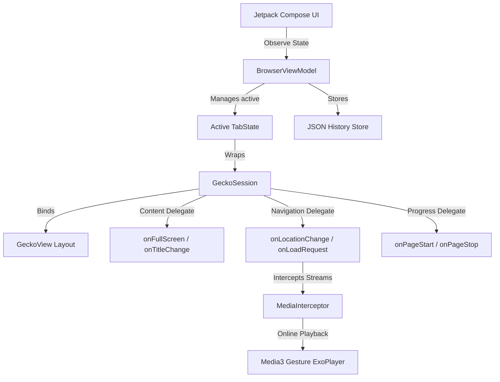

# 🌐 Omni Browser

<p align="center">
  
</p>

<p align="center">
  <strong>A premium, privacy-first mobile web browser for Android. Built with Jetpack Compose & GeckoView.</strong>
</p>

<p align="center">
  <a href="https://kotlinlang.org/"></a>
  <a href="https://developer.android.com/jetpack/compose"></a>
  <a href="https://mozilla.github.io/geckoview/"></a>
  <a href="LICENSE"></a>
</p>

---

## 📖 Overview

**Omni Browser** is a state-of-the-art web browser developed by **RebelRoot**, a collective of independent developers dedicated to building secure, open-source software that solves the root problems of digital surveillance, bloat, and restrictions. 

Powered by the robust **Mozilla GeckoView** engine and designed with **Jetpack Compose (Material 3)**, Omni Browser delivers desktop-grade performance, native WebExtension support, offline machine-learning tools, and secure media engines in a unified, premium Obsidian-dark layout.

---

## ⚡ Core Features

### 🛡️ Privacy & Security
* **Built-in Ad & Tracker Blocker**: Deep integration with pre-bundled **uBlock Origin** to strip advertising networks, track scripts, and cookie prompts.
* **Incognito Sandbox**: Toggling Private Browsing immediately closes active session contexts, isolated from persistent storage.
* **Instant Burn**: A one-tap "Burn" button that uses GeckoRuntime garbage-collection loops to wipe current history, cache, tabs, and session cookies from memory.
* **Keystore-Encrypted Locker**: Pin-code and biometric-protected local vault to store private downloads, protected using hardware-backed AES encryption.

### 🔌 Extensibility
* **Firefox WebExtensions Support**: Direct compatibility with Firefox Android `.xpi` add-ons (like Dark Reader, Privacy Badger, etc.).
* **Native Options Router**: Directly navigate to custom extension settings pages (e.g. configuration dashboards) in standard browser tabs via the Extensions Manager.

### 🎥 Playback & Media Sniffing
* **Aggressive Stream Sniffer**: Background service that intercepts online video packets (HLS, DASH, Blob, and MSE streams), rendering a unified download action card.
* **ExoPlayer Media Integration**: Custom hardware-decoded video player featuring gesture swipe volume/brightness, playback speeds, picture-in-picture (PiP), and background audio.

### 🧠 On-Device Smart Tools
* **Device-Local Offline Translator**: 100% private page translation powered on-device by Google ML Kit models.
* **Smart Document Scanner**: Document edge detection and image perspective cleaning.
* **QR & Barcode Utilities**: Integrated ML-powered scanner to extract URLs, Wi-Fi networks, and contact files.

---

## 📐 Architecture & Data Flow

Omni Browser utilizes a clean, unidirectional architecture, binding declarative Jetpack Compose components directly to the asynchronous callback loops of GeckoView:



---

## 📁 Repository Structure

```
omni-browser/
├── app/
│   ├── src/
│   │   ├── main/
│   │   │   ├── assets/              # Pre-bundled WebExtensions (uBlock, Media Sniffer)
│   │   │   ├── java/com/rebelroot/omni/
│   │   │   │   ├── browser/          # Main Compose layouts, Screens & ViewModels
│   │   │   │   ├── history/          # Dynamic JSON-based History Store
│   │   │   │   ├── media/            # ExoPlayer playback & MSE Interceptor Engine
│   │   │   │   ├── privacy/          # Private Locker vault & Session Incineration
│   │   │   │   ├── tools/            # ML Kit Scanner, QR Tools & Translators
│   │   │   │   └── vpn/              # WireGuard VPN tunnel interfaces
│   │   │   └── res/                  # Visual themes, vectors & assets
│   │   ├── proguard-rules.pro        # Code shrinking & obfuscation configurations
│   │   └── build.gradle.kts          # Application build dependencies & target definitions
```

---

## 🛠️ Build & Installation

### Prerequisites
* **Android Studio Ladybug+** (or command-line tools matching Gradle 8.13+)
* **JDK 17** (Ensure your `JAVA_HOME` environment variable points to your JDK directory)
* **Android SDK** (Target API 34/35)
* Support for physical or emulated `arm64-v8a` device architectures

### Build Steps
1. **Clone the repository:**
   ```bash
   git clone https://github.com/rebelroot/omni-browser.git
   cd omni-browser
   ```

2. **Verify target code compilation:**
   ```bash
   ./gradlew compileDebugKotlin
   ```

3. **Assemble the Debug APK:**
   ```bash
   ./gradlew assembleDebug
   ```
   The output APK will be generated at `app/build/outputs/apk/debug/app-debug.apk`.

---

## 🤝 Contributing

We welcome code audits, optimizations, and additions from the open-source community. If you would like to contribute:
1. Fork the project repository.
2. Create your feature branch (`git checkout -b feature/NewAwesomeFeature`).
3. Commit your changes (`git commit -m 'Add awesome feature'`).
4. Push to the branch (`git push origin feature/NewAwesomeFeature`).
5. Open a **Pull Request**.

Please review our [CONTRIBUTING.md](CONTRIBUTING.md) and security guidelines before submitting code.

---

## 📄 License

This project is licensed under the MIT License. See the [LICENSE](LICENSE) file for details.

---

<p align="center">
  Made with 💻 and ☕ by independent developers @ <strong>RebelRoot</strong>.
</p>
