# 🌐 Omni Browser

Omni Browser is a premium, open-source, mobile web browser for Android built entirely on **Jetpack Compose** and the high-performance **Mozilla GeckoView** engine. It combines advanced custom browser features with strict privacy guards, on-device machine learning capabilities, and a media playback suite.

---

## 🚀 Key Features

* **💻 Desktop Chrome-like Multi-Tabs**: A horizontal, scrollable tab strip at the top left of the screen allowing users to easily open, switch, and close active tabs. Scoped progress and location listeners isolate background loading events from clobbering active tab state.
* **📜 On-Device Persistent History**: A lightweight, robust JSON-based file store containing visited page titles, URLs, and timestamps with full regex SearchBar filtering and clean deletion delegates.
* **🛡️ Built-in Adblocker (uBlock Origin)**: Deeply integrated uBlock Origin extension with nativeCompose toggling to dynamically block ads and malicious trackers.
* **🕵️ Safe Private / Incognito Mode**: Fully reactive incognito toggling directly from the browser tools dropdown. Toggling private mode immediately closes the active session and spawns a new isolated session emulated in private memory.
* **🎥 Media3 Gesture Video Player**: Intercepts HLS (m3u8)/HTTP video streams using dynamic content sniffing and injects full gesture control brightness/volume, PiP (Picture-in-Picture), and background audio playback using Google's modern Media3 ExoPlayer.
* **🔒 Encrypted Private Locker Vault**: A biometric-secured sandboxed container to download files privately, encrypted via Keystore AES.
* **🌐 Device-Local Offline Translator**: A 100% private, on-device machine learning translation box backed by Google ML Kit.
* **🔌 Military-Grade WireGuard VPN**: Integrated Go-backend WireGuard interface configured for Contabo VPS preset, enabling secure single-tap VPN connections.
* **🔍 Google ML Kit Document Scanner**: Native auto-perspective scanner that cleans and processes paper copies with high visual accuracy.
* **📱 16 KB Page Size NDK Alignment**: Enforces packaging boundaries (via AGP 8.5.1+) supporting modern Android 15/16 devices with 16 KB page size kernel compatibility.

---

## 📐 Architecture Overview

Omni Browser uses a completely decoupled architecture, binding Compose state components directly to GeckoView's asynchronous delegates:

```mermaid
graph TD
    UI[Jetpack Compose UI] -->|Observe State| VM[BrowserViewModel]
    VM -->|Manages active| Tab[Active TabState]
    VM -->|Stores| Hist[JSON History Store]
    Tab -->|Wraps| GS[GeckoSession]
    GS -->|Binds| GV[GeckoView Layout]
    GS -->|Content Delegate| CD[onFullScreen / onTitleChange]
    GS -->|Navigation Delegate| ND[onLocationChange / onLoadRequest]
    GS -->|Progress Delegate| PD[onPageStart / onPageStop]
    
    ND -->|Intercepts Streams| MI[MediaInterceptor]
    MI -->|Online Playback| MP[Media3 Gesture ExoPlayer]
```



---

## 🛠️ Build & Setup Instructions

### Prerequisites
* **Android Studio JBR** or standard JDK 17+
* **Android SDK** with target API 34/35
* Support for physical or emulated ARM64-v8a devices

### Compilation
Ensure your `JAVA_HOME` points to your JDK directory, then run:

```bash
./gradlew compileDebugKotlin
```

To assemble the debug APK:

```bash
./gradlew assembleDebug
```

---

## 🤝 Contributing

We welcome contributions from the open-source community! Whether you are fixing bugs, optimizing GeckoView JNI boundaries, or refining the styling, please feel free to fork this repository and submit a Pull Request. Refer to our [CONTRIBUTING.md](CONTRIBUTING.md) for more details.

---

## 📄 License

This project is licensed under the MIT License - see the [LICENSE](LICENSE) file for details.
