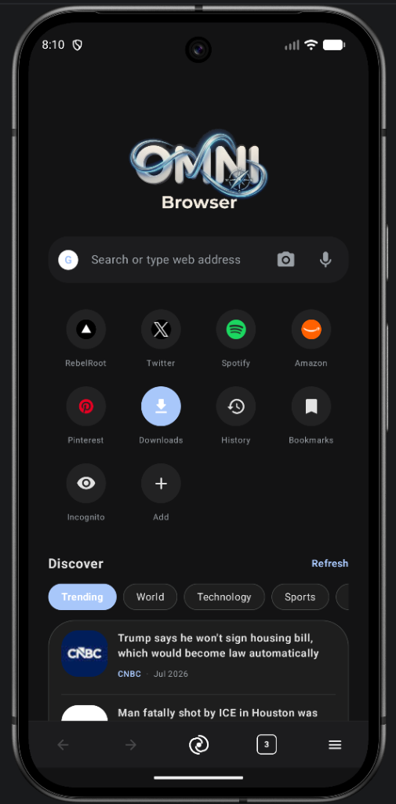
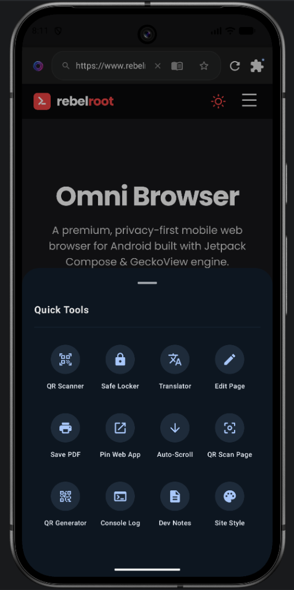
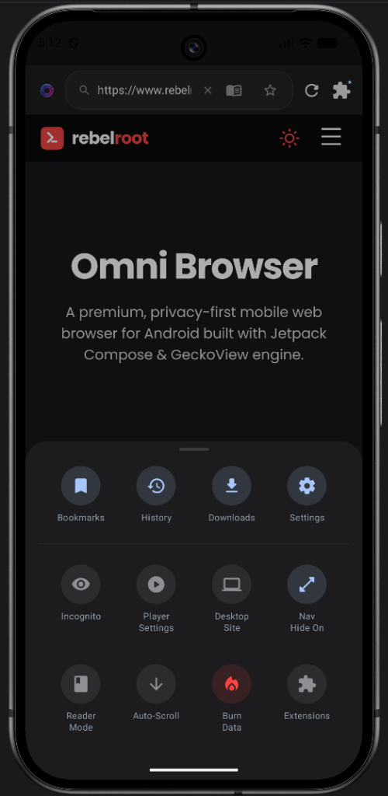
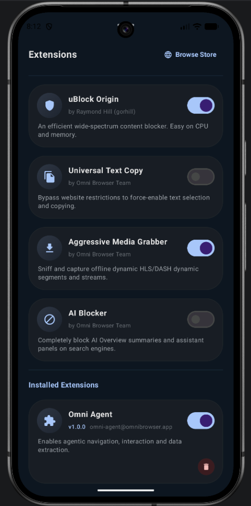
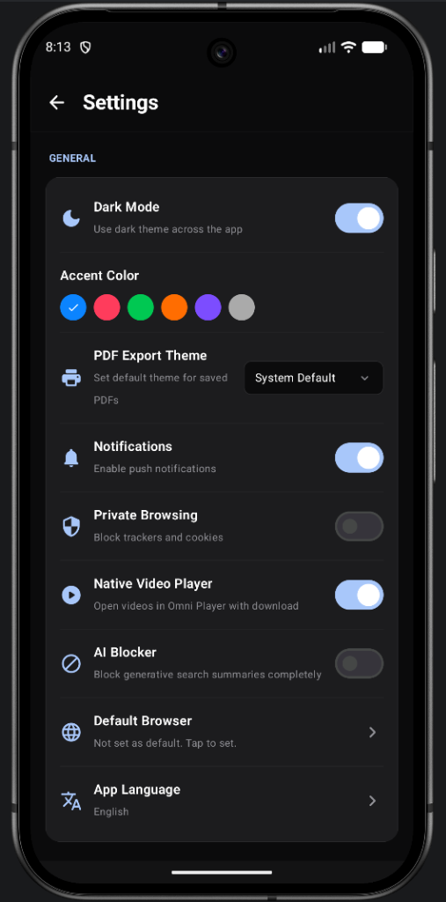
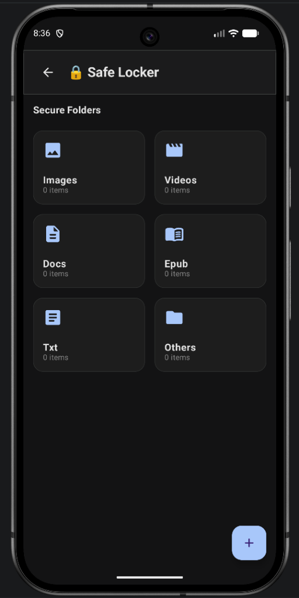
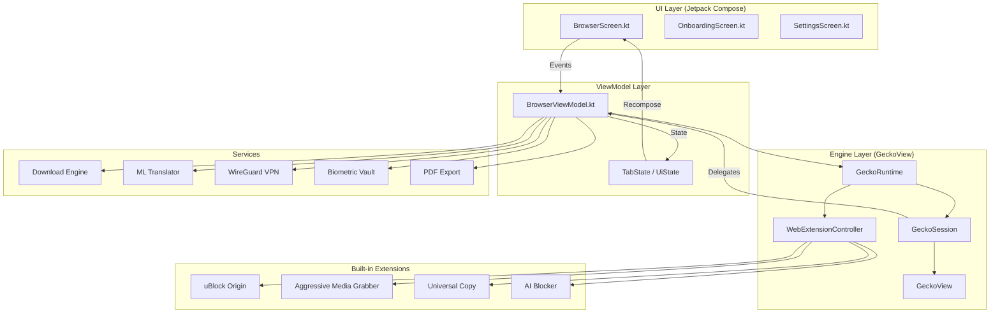

<div align="center">
  

  <h1>Omni Browser</h1>

  <p><strong>A premium, privacy-first Android browser built with Jetpack Compose & Mozilla GeckoView.</strong></p>

  <a href="https://kotlinlang.org/"></a>
  <a href="https://developer.android.com/jetpack/compose"></a>
  <a href="https://mozilla.github.io/geckoview/"></a>
  <a href="LICENSE"></a>
  <a href="https://github.com/REBEL-ROOT/omni-browser/releases"></a>
  <a href="https://github.com/REBEL-ROOT/omni-browser/issues"></a>
  <a href="https://www.linkedin.com/company/rebelroot"></a>
  <a href="https://ko-fi.com/rebelroot"></a>

  <br /><br />

  <a href="https://github.com/REBEL-ROOT/omni-browser/releases/latest">
    
  </a>

</div>

---

> [!CAUTION]
> **🧪 Experimental Software — Use With Caution**
>
> Omni Browser is currently in **active development and experimental phase**. Features may be incomplete, unstable, or subject to significant change without notice. You may encounter bugs, crashes, or unexpected behaviour.
>
> - ⚠️ **Not recommended as your sole/primary browser yet**
> - 🐛 **Bugs are expected** — please [report them](https://github.com/REBEL-ROOT/omni-browser/issues)
> - 🔄 **APIs and features may change** between releases
> - 💾 **Back up any important data** stored in the app (vault, notes)
>
> We appreciate your patience and feedback as we work toward a stable release. 🙏

---

## 📸 Screenshots

| Home | Quick Tools | Browser Menu |
|:---:|:---:|:---:|
|  |  |  |

| Extensions | Settings | Safe Locker |
|:---:|:---:|:---:|
|  |  |  |

---

## ✨ Overview

**Omni Browser** is a state-of-the-art mobile web browser built by **RebelRoot** — an independent development collective focused on privacy, performance, and open-source freedom.

Powered by **Mozilla GeckoView** (the same engine behind Firefox), Omni delivers desktop-grade browsing, native Firefox WebExtension support, hardware-decoded media playback, and a fully offline AI toolkit — all wrapped in a premium OLED-dark Jetpack Compose interface.

---

## ⚡ Features

### 🏠 Home & Navigation
| Feature | Details |
|---|---|
| **Smart Home Screen** | Search bar, quick-access site shortcuts, Discover news feed (Trending, World, Technology, Sports) |
| **Quick Access Grid** | Pinned shortcuts to RebelRoot, Twitter, Spotify, Amazon, Pinterest + Downloads, History, Bookmarks |
| **Incognito Shortcut** | One-tap incognito launch directly from the home screen |
| **Multi-Tab** | Chrome-like tab strip with open tab count indicator |

### 🛡️ Privacy & Security
| Feature | Details |
|---|---|
| **Built-in Ad Blocker** | Pre-bundled uBlock Origin blocks ads, trackers & telemetry across 70+ networks |
| **Incognito Mode** | Fully isolated private session — no history, cookies, or cache saved |
| **Extensions in Incognito** | All extensions work inside private tabs |
| **Burn Data** | One-tap wipe of all history, cache, cookies, and session data |
| **Safe Locker** | Biometric AES-256 hardware-backed encrypted vault for private files |

### 🔌 Extensions
| Extension | Details |
|---|---|
| **uBlock Origin** | Efficient wide-spectrum content blocker — easy on CPU and memory |
| **Universal Text Copy** | Bypass website restrictions to force-enable text selection & copying |
| **Aggressive Media Grabber** | Sniff and capture HLS/DASH streams and dynamic segments |
| **AI Blocker** | Block AI Overview summaries and assistant panels on search engines |
| **Install from Store** | Install any Firefox Android `.xpi` add-on from addons.mozilla.org |

### 🛠️ Quick Tools Panel
| Tool | Details |
|---|---|
| **QR Scanner** | Scan QR codes and barcodes via camera |
| **Translator** | 100% on-device offline translation via Google ML Kit |
| **Edit Page** | Inject custom JS/CSS to modify any web page live |
| **Save PDF** | Export any page as a PDF document |
| **Pin Web App** | Add any website to the home screen as a PWA-style shortcut |
| **Auto-Scroll** | Hands-free automatic page scrolling |
| **QR Scan Page** | Scan QR codes found on the current web page |
| **QR Generator** | Generate QR codes from any text or URL |
| **Console Log** | Live JavaScript developer console REPL |
| **Dev Notes** | Secure offline scratchpad for developer notes |
| **Site Style** | Apply custom visual styles to any site |

### 🎥 Media
| Feature | Details |
|---|---|
| **Stream Sniffer** | Captures HLS, DASH, MP4, and MSE streams automatically |
| **Omni Player** | ExoPlayer with swipe gestures, speed control, PiP, background audio |
| **Player Settings** | Configurable player behavior from the browser menu |

### ⚙️ Settings
| Setting | Details |
|---|---|
| **Dark Mode** | OLED-black dark theme across the entire app |
| **Accent Color** | Choose from 5 accent colors (blue, red, green, orange, purple) |
| **PDF Export Theme** | System Default / Light / Dark PDF rendering |
| **Native Video Player** | Open videos in Omni Player with auto-download support |
| **Private Browsing** | Block all trackers and cookies globally |
| **AI Blocker** | Block generative search summaries completely |
| **Default Browser** | Set Omni as your system default browser |
| **App Language** | Multi-language support with global locale switching |

---

## 📐 Architecture

Omni Browser uses a clean **MVVM + Unidirectional Data Flow** architecture, binding Jetpack Compose UI directly to GeckoView through a central `BrowserViewModel`.



> See [docs/ARCHITECTURE.md](docs/ARCHITECTURE.md) for the full component breakdown.

### Repository Structure

```
omni-browser/
├── app/src/main/
│   ├── assets/web_extensions/        # Bundled WebExtensions (uBlock, Grabber, Copy, AI)
│   ├── java/com/rebelroot/omni/
│   │   ├── browser/                  # Core browser screen + ViewModel
│   │   │   └── extensions/           # Extension manager classes
│   │   ├── media/player/             # ExoPlayer + MSE stream interceptor
│   │   ├── onboarding/               # Language selection & onboarding slides
│   │   ├── privacy/                  # Biometric Locker vault
│   │   ├── settings/                 # Settings screen composable
│   │   ├── tools/                    # QR, Translator, PDF, Console, Dev Notes
│   │   ├── ui/theme/                 # Colors, typography, shapes
│   │   └── vpn/                      # WireGuard VPN manager
├── images/
│   ├── screenshots/                  # 📸 App screenshots
│   │   ├── home.png
│   │   ├── quick_tools.png
│   │   ├── browser_menu.png
│   │   ├── extensions.png
│   │   └── settings.png
│   └── demo.gif                      # 🎬 Screen recording demo
├── docs/
│   ├── ARCHITECTURE.md
│   └── SECURITY.md
├── CHANGELOG.md
├── CONTRIBUTING.md
├── PRIVACY_POLICY.md
└── LICENSE
```

---

## 🛠️ Build & Installation

### Prerequisites
- **Android Studio Ladybug** or newer
- **JDK 17** (`JAVA_HOME` must be set)
- **Android SDK** — Target API 35 (Android 15)
- Device running Android 8.0+ (API 26+)

### Build Commands

```bash
# Clone
git clone https://github.com/REBEL-ROOT/omni-browser.git
cd omni-browser

# Compile check
./gradlew compileDebugKotlin

# Debug APK
./gradlew assembleDebug
# → app/build/outputs/apk/debug/app-debug.apk

# Release bundle (AAB)
./gradlew bundleRelease
# → app/build/outputs/bundle/release/app-release.aab
```

### Pre-built Releases

Download the latest signed APK from our [**Releases Page**](https://github.com/REBEL-ROOT/omni-browser/releases/latest).

---

## 🗺️ Roadmap

### ✅ Completed (v1.0 – v1.2.2)
- [x] Multi-tab browsing with GeckoView
- [x] Incognito / Private mode with full isolation
- [x] Firefox WebExtension support (.xpi)
- [x] Built-in ad & tracker blocker (70+ networks)
- [x] Extensions working inside Incognito mode
- [x] uBlock Origin, Universal Copy, AI Blocker, Media Grabber
- [x] Media stream sniffer + Omni ExoPlayer
- [x] Biometric AES vault for private files
- [x] Offline ML translator (Google ML Kit)
- [x] QR Scanner, Generator & Page Scan
- [x] WireGuard VPN integration
- [x] Interactive JS developer console REPL
- [x] Developer Notes offline scratchpad
- [x] Save page as PDF
- [x] Auto-scroll
- [x] Pin Web App to home screen
- [x] Custom site styles
- [x] Accent color picker
- [x] UPI & deep-link intent routing
- [x] Desktop mode per tab
- [x] Android 15+ edge-to-edge UI
- [x] Discover news feed (Trending, World, Tech, Sports)

### 🔜 Planned (v1.3+)
- [ ] Tab groups — collapsible named groups
- [ ] Reading mode — distraction-free article view
- [ ] Custom homepage widgets (news, weather)
- [ ] Password manager integration
- [ ] Web3 / dApp support (MetaMask-compatible)
- [ ] Split-screen dual-tab view for tablets
- [ ] Advanced download manager (queue, resume)
- [ ] Offline page saving
- [ ] Bookmarks & history sync (encrypted cloud)
- [ ] Custom CSS injection per site

---

## 🤝 Contributing

We welcome contributions from the open-source community! Please read [**CONTRIBUTING.md**](CONTRIBUTING.md) before submitting a PR.

```bash
git checkout -b feature/your-feature
# make changes
git commit -m "Add: short description"
git push origin feature/your-feature
# open a Pull Request
```

**We especially need help with:**
- 🌐 Translations & localization
- 🧪 Unit and UI test coverage
- 📖 Documentation improvements
- 🐛 Bug reports and fixes

---

## 📄 License

This project is licensed under the **GNU General Public License v3 (GPLv3)**.

```
Omni Browser — Copyright (C) 2026 RebelRoot Ltd
This is free software: you can redistribute it and/or modify it
under the terms of the GPLv3. See LICENSE for details.
```

---

## 🔒 Security

To report a vulnerability, use GitHub's private [Security Advisory](https://github.com/REBEL-ROOT/omni-browser/security/advisories/new) system — **do not open a public issue**. See [docs/SECURITY.md](docs/SECURITY.md).

---

<div align="center">
  <sub>Made with 💻 and ☕ by <strong>RebelRoot</strong> &nbsp;|&nbsp; Powered by <a href="https://mozilla.github.io/geckoview/">Mozilla GeckoView</a></sub>
  <br />
  <sub><a href="https://www.linkedin.com/company/rebelroot">🔗 LinkedIn</a> &nbsp;|&nbsp; <a href="https://ko-fi.com/rebelroot">☕ Support us on Ko-fi</a></sub>
</div>
