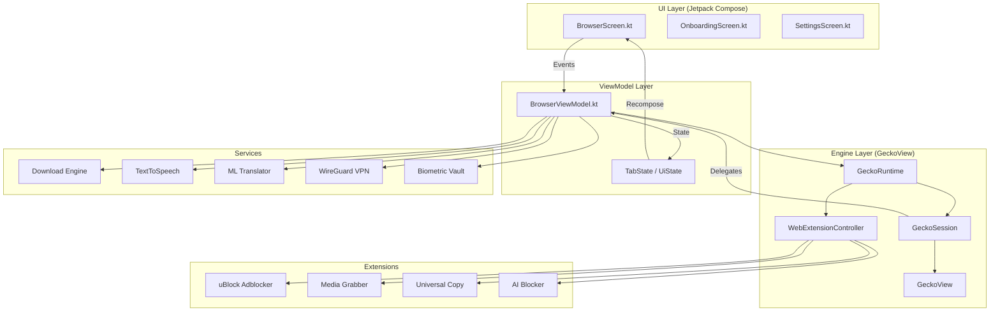

<div align="center">
  

  <h1>Omni Browser</h1>

  <p><strong>A premium, privacy-first Android browser built with Jetpack Compose & Mozilla GeckoView.</strong></p>

  <a href="https://kotlinlang.org/"></a>
  <a href="https://developer.android.com/jetpack/compose"></a>
  <a href="https://mozilla.github.io/geckoview/"></a>
  <a href="LICENSE"></a>
  <a href="https://github.com/REBEL-ROOT/omni-browser/releases"></a>
  <a href="https://github.com/REBEL-ROOT/omni-browser/issues"></a>

  <br /><br />

  <a href="https://github.com/REBEL-ROOT/omni-browser/releases/latest">
    
  </a>

</div>

---

## 📸 Screenshots

> 📂 Place your screenshot images inside `images/screenshots/` and the filenames will map automatically below.

| Browser | Incognito | Extensions |
|:---:|:---:|:---:|
|  |  |  |

| Media Player | Settings | Quick Tools |
|:---:|:---:|:---:|
|  |  |  |

> 🎬 **Demo GIF** — Place your recording at `images/demo.gif` then uncomment the line below:
>
> <!--  -->

---

## ✨ Overview

**Omni Browser** is a state-of-the-art mobile web browser built by **RebelRoot** — an independent development collective focused on privacy, performance, and open-source freedom.

Powered by **Mozilla GeckoView** (the same engine behind Firefox), Omni delivers desktop-grade browsing capabilities, native Firefox WebExtension support, hardware-decoded media playback, and a fully offline AI toolkit — all wrapped in a premium OLED-dark Jetpack Compose interface.

---

## ⚡ Features

### 🛡️ Privacy & Security
| Feature | Details |
|---|---|
| **Built-in Ad Blocker** | Pre-bundled uBlock engine blocks ads, trackers, and telemetry across 70+ networks |
| **Incognito Mode** | Fully isolated private session with no persistent history, cookies, or cache |
| **Extensions in Incognito** | All extensions work inside private tabs including the adblocker |
| **Instant Burn** | One-tap wipe of all history, cache, cookies, and session data |
| **Biometric Vault** | AES hardware-backed Keystore encrypted locker for private downloads |

### 🔌 Extensions & Customization
| Feature | Details |
|---|---|
| **Firefox WebExtensions** | Install any Firefox Android `.xpi` add-on from addons.mozilla.org |
| **Built-in Extensions** | uBlock Origin, Universal Copy, AI Blocker, Media Grabber |
| **Extension Manager** | Toggle, install, uninstall, and launch extension popups from one panel |

### 🎥 Media & Downloads
| Feature | Details |
|---|---|
| **Stream Sniffer** | Captures HLS, DASH, MP4, and MSE media streams automatically |
| **ExoPlayer Integration** | Hardware-decoded player with swipe gestures, PiP, background audio |
| **Offline Downloader** | Save videos, documents, and files to local or encrypted vault storage |

### 🧠 On-Device AI Tools
| Feature | Details |
|---|---|
| **ML Translator** | 100% offline page translation via Google ML Kit |
| **QR Scanner** | Scan QR codes, barcodes, Wi-Fi credentials from camera or page |
| **AI Content Blocker** | Blocks AI-generated ads, widgets, and cookie banners |
| **JS Console REPL** | Interactive JavaScript developer console with live page execution |

### 🌐 Browser Engine
| Feature | Details |
|---|---|
| **GeckoView v145** | Latest Mozilla Gecko engine — full Firefox compatibility |
| **Multi-Tab** | Chrome-like scrollable tab strip with incognito tab grouping |
| **Desktop Mode** | Toggle desktop user-agent and viewport per tab |
| **Custom UA Strings** | OAuth-compatible Firefox user-agents for all major providers |
| **Edge-to-Edge UI** | Full Android 15+ edge-to-edge display support |

---

## 📐 Architecture

Omni Browser uses a clean **MVVM + Unidirectional Data Flow** architecture, binding Jetpack Compose UI directly to GeckoView through a central `BrowserViewModel`.



> See [docs/ARCHITECTURE.md](docs/ARCHITECTURE.md) for full component breakdown.

### Repository Structure

```
omni-browser/
├── app/src/main/
│   ├── assets/web_extensions/        # Bundled WebExtensions
│   ├── java/com/rebelroot/omni/
│   │   ├── browser/                  # Core browser + ViewModel
│   │   │   └── extensions/           # Extension manager classes
│   │   ├── media/player/             # ExoPlayer + MSE interceptor
│   │   ├── onboarding/               # Language selection & slides
│   │   ├── privacy/                  # Biometric Locker vault
│   │   ├── settings/                 # Settings screen
│   │   ├── tools/                    # QR, Translator, Console
│   │   ├── ui/theme/                 # Colors, typography, shapes
│   │   └── vpn/                      # WireGuard VPN manager
├── images/
│   ├── screenshots/                  # 📸 Add your screenshots here
│   └── demo.gif                      # 🎬 Add your GIF demo here
├── docs/
│   ├── ARCHITECTURE.md
│   └── SECURITY.md
├── CHANGELOG.md
├── CONTRIBUTING.md
├── PRIVACY_POLICY.md
└── LICENSE
```

---

## 🛠️ Build & Installation

### Prerequisites
- **Android Studio Ladybug** or newer
- **JDK 17** (`JAVA_HOME` must be set)
- **Android SDK** — Target API 35 (Android 15)
- Device running Android 8.0+ (API 26+)

### Build Commands

```bash
# Clone
git clone https://github.com/REBEL-ROOT/omni-browser.git
cd omni-browser

# Compile check
./gradlew compileDebugKotlin

# Debug APK
./gradlew assembleDebug
# → app/build/outputs/apk/debug/app-debug.apk

# Release bundle (AAB)
./gradlew bundleRelease
# → app/build/outputs/bundle/release/app-release.aab
```

### Pre-built Releases

Download the latest signed APK directly from our [**Releases Page**](https://github.com/REBEL-ROOT/omni-browser/releases/latest).

---

## 🗺️ Roadmap

### ✅ Completed (v1.0 – v1.2.2)
- [x] Multi-tab browsing with GeckoView
- [x] Incognito / Private mode with full isolation
- [x] Firefox WebExtension support (.xpi install)
- [x] Built-in ad & tracker blocker (70+ networks)
- [x] Extensions working in Incognito mode
- [x] Media stream sniffer + ExoPlayer
- [x] Biometric AES vault for private downloads
- [x] Offline ML translator (Google ML Kit)
- [x] QR code & barcode scanner
- [x] WireGuard VPN integration
- [x] Interactive JS developer console REPL
- [x] UPI & deep-link intent routing
- [x] Desktop mode toggle per tab
- [x] Android 15+ edge-to-edge UI
- [x] Large screen / tablet resizability

### 🔜 Planned (v1.3+)
- [ ] Tab groups — collapsible named groups
- [ ] Reading mode — distraction-free article view
- [ ] Custom homepage widgets (news, weather)
- [ ] Password manager integration
- [ ] Web3 / dApp support (MetaMask-compatible)
- [ ] Split-screen dual-tab view for tablets
- [ ] Advanced download manager with queue & resume
- [ ] Offline page saving for later reading
- [ ] Bookmarks & history sync (encrypted cloud)
- [ ] Custom CSS injection per site

---

## 🤝 Contributing

We welcome contributions from the open-source community! Please read [**CONTRIBUTING.md**](CONTRIBUTING.md) before submitting a PR.

**Quick start:**
```bash
git checkout -b feature/your-feature
# make changes
git commit -m "Add: short description"
git push origin feature/your-feature
# open a Pull Request on GitHub
```

**We especially need help with:**
- 🌐 Translations & localization
- 🧪 Unit and UI test coverage
- 📖 Documentation improvements
- 🐛 Bug reports and fixes

---

## 📄 License

This project is licensed under the **GNU General Public License v3 (GPLv3)**.

```
Omni Browser — Copyright (C) 2026 RebelRoot Ltd
This program comes with ABSOLUTELY NO WARRANTY.
This is free software, and you are welcome to redistribute it
under the terms of the GPLv3. See LICENSE for details.
```

---

## 🔒 Security

To report a security vulnerability, please use GitHub's **private security advisory** system — do **not** open a public issue. See [docs/SECURITY.md](docs/SECURITY.md) for our full responsible disclosure policy.

---

<div align="center">
  <sub>Made with 💻 and ☕ by <strong>RebelRoot</strong> &nbsp;|&nbsp; Powered by <a href="https://mozilla.github.io/geckoview/">Mozilla GeckoView</a></sub>
</div>
